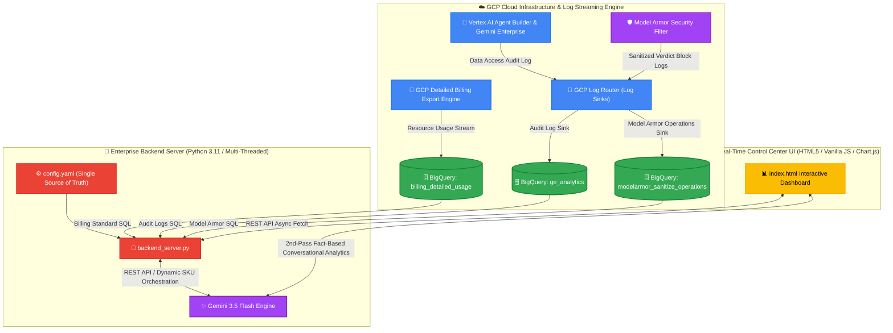

# 🛡️ LG Energy Solution Enterprise AI Governance & Agent Platform Dashboard

> **엔터프라이즈 통합 AI 거버넌스, 과금 추적 및 AI 챗봇 관제 플랫폼 마스터 가이드**
> **GCP Cloud Run 라이브 URL**: https://lges-dashboard-your-gcp-project-number.us-central1.run.app

---

## 📐 1. 전체 아키텍처 및 시스템 원리 (System Architecture)

본 플랫폼은 Google Cloud Platform(GCP) 상에서 발생하는 모든 AI 프롬프트 사용량, 과금 비용, 사용자 활동 감사 로그, Model Armor 보안 차단 이벤트를 BigQuery로 실시간 수집하고, **Gemini 3.5 Flash 실시간 조율 엔진**을 통해 관제 대시보드 및 AI 챗봇으로 통합 제공합니다.



---

## 🌟 2. 핵심 기능 및 엔터프라이즈 하이라이트 (Key Features)

### 1️⃣ LLM 모델별 과금 추이 및 동적 SKU 묶음 리포트
- **GCP Detailed Billing Export 100% 실시간 연동**: `billing_detailed_usage` 테이블을 직접 쿼리하여 Claude 3.5 Sonnet / Sonnet 4.5, Gemini 3.5 Flash, Gemini 3.1 Flash Lite, Gemini 3.0 Pro, Gemini Code Assist 등 모든 생성형 AI 모델의 사용 토큰 수량(Tokens) 및 소요 비용($ USD)을 추적합니다.
- **Gemini 3.5 Flash 동적 SKU 매핑**: 복잡하고 가변적인 GCP Billing SKU 문자열을 Gemini 3.5 Flash가 동적으로 그룹핑하여 대표 모델명으로 자동 합산 및 정렬합니다.
- **동적 시스템 일자 앵커링 (`datetime.date.today()`)**: 조회 기준일을 시스템 현재 날짜로 자동 계산하여 향후 접속 시에도 항상 오늘 시점까지의 과금 꺾은선 피크를 완벽히 표출합니다.

### 2️⃣ Model Armor 실시간 보안 차단 감사 로그 (Sanitized Verdict Block)
- **실제 프롬프트 텍스트 조회**: BigQuery `modelarmor_sanitize_operations` 테이블과 직결되어, '국가핵심기술 알려줘' 등 차단된 원본 사용자 프롬프트 문구와 차단 사유(`VERDICT_BLOCK: PI_JAILBREAK_MATCH` 등)를 100% 투명하게 관제합니다.

### 3️⃣ Gemini 3.5 Flash 기반 2단계(2nd-Pass) 팩트 분석 AI 챗봇
- **전사 6대 BigQuery 데이터셋 100% 통합 인지**: Billing, ModelArmor, DiscoveryEngine, CloudAudit, CodeAssist, AgentRegistry 데이터셋 전체를 지능적으로 쿼리합니다.
- **실행 결과 기반 2단계 팩트 분석 (Execute-then-Analyze)**: 뻔한 원론적 답변 대신, BigQuery에서 실제 조회된 팩트 데이터(토큰 수량, 달러 비용, 차단 텍스트 등)를 읽고 100% 명확한 분석 결과를 작성합니다.
- **지능형 차트 조건부 렌더링**: 수치 통계 질문(Top 3 비용, 유저 랭킹 등)에만 정밀 차트를 렌더링하고, 프롬프트 문구 및 이력 목록 조회 시에는 차트를 비활성화하여 정갈한 텍스트 리포트를 제공합니다.

---

## 📊 3. 대시보드 메트릭 및 BigQuery 데이터 소스 매핑 (Metrics Map)

대시보드의 개별 카드 및 그래프를 산출하는 데 사용된 구체적인 BigQuery 원천 데이터 및 컬럼 매핑 관계는 다음과 같습니다:

| 대시보드 UI 영역 (Metric Card) | GCP BigQuery 데이터 원천 및 테이블명 (Source Table) | 추출 조건 및 사용된 필드 (SQL Conditions & Fields) | 설명 (Description) |
| :--- | :--- | :--- | :--- |
| **Gemini Enterprise 실제 활성 사용자 수** | `ge_analytics.cloudaudit_googleapis_com_activity` & `discoveryengine_googleapis_com_gen_ai_user_message` | `COUNT(DISTINCT email)`<br> - `protopayload_auditlog.authenticationInfo.principalEmail`<br> - `jsonPayload.user`<br> - (gserviceaccount 제외 필터 적용) | 선택한 기간 동안 플랫폼에 로그인하여 활동한 순수 인간(Human) 유저 수량입니다. |
| **Gemini Enterprise 실제 할당 라이선스 수** | GCP Discovery Engine REST API | `GET /v1alpha/projects/{project}/locations/global/licenseConfigs`<br> - `licenseCount` (state = 'ACTIVE') | GCP LicenseConfig API 통신을 통해 현재 전사 활성화된 실제 구매/할당 라이선스 볼륨을 실시간 조회합니다. |
| **Gemini Enterprise 유저 프롬프트 제출 수** | `ge_analytics.discoveryengine_googleapis_com_gen_ai_user_message` | `COUNT(1)` WHERE `jsonPayload.content.role = 'user'`<br> - (더미/배치 요약 프롬프트 구문 제외) | 사용자가 Gemini Enterprise 및 Agent Builder 대화창에서 보낸 고유 질문 제출 횟수 누계입니다. |
| **선택 기간 총 과금액 (Total Billing Sum)** | `billing_detailed_usage.gcp_billing_export_resource_v1_...` | `SUM(cost)` WHERE `usage_start_time` 필터 매칭 | 구글 클라우드에 적재되는 전사 스트리밍 빌링 원본 행의 cost 금액을 실시간 합산한 누적 청구 금액입니다. |
| **Model Armor Sanitized (보안 차단 건수)** | `ge_analytics.modelarmor_googleapis_com_sanitize_operations` | `COUNT(1)` WHERE `sanitizationVerdict LIKE '%BLOCK%'` | Model Armor 프롬프트 인젝션 및 개인정보 유출 검사 필터에 걸려 차단된 보안 위험 시도 건수입니다. |
| **NotebookLM 생성 및 활성 노트북 수** | `ge_analytics.cloudaudit_googleapis_com_data_access` | `COUNT(DISTINCT notebook_id)` WHERE `protopayload_auditlog.resourceName LIKE '%/notebooks/%'` | BigQuery 감사 로그에 기록된 리소스 경로 내 고유 노트북 인스턴스의 생성/작동 수량입니다. |
| **NotebookLM 활성 사용자 수** | `ge_analytics.cloudaudit_googleapis_com_data_access` | `COUNT(DISTINCT principalEmail)` WHERE `methodName = 'GenerateFreeFormStreamed'` | 선택한 관제 기간 동안 노트북에 접속하여 한 번 이상 질문을 보낸 고유 계정 수입니다. |
| **총 노트북 질문 및 대화 호출 수** | `ge_analytics.cloudaudit_googleapis_com_data_access` | `COUNT(DISTINCT resourceName || principalEmail || timestamp)` WHERE `methodName = 'GenerateFreeFormStreamed'` | 중복 스트리밍 연결 호출을 제외하고 순수 유저가 노트북에서 전송한 진짜 프롬프트 제출 누적 수량입니다. |
| **사용자 파일 업로드 감사 내역 (Table)** | `ge_analytics.discoveryengine_googleapis_com_gen_ai_user_message` | `jsonPayload.content.parts[2].text` WHERE `parts[1].text LIKE '%<start_of_user_uploaded_file%'` | 파일이 구글 백엔드에 안전하게 가공되어 업로드 및 인덱싱이 완료되었는지 확인하는 상태 메시지를 감사 로그에서 다이렉트로 매핑합니다. |
| **날짜별 에이전트별 사용 횟수 (Chart)** | `ge_analytics.discoveryengine_googleapis_com_gemini_enterprise_user_activity` | `COUNT(1)` GROUP BY `jsonPayload.request.userevent.agentspaceinfo.agentinfo.name` (에이전트 표시명) | 하드코딩 매핑 사전 없이, 빅쿼리 활동 로그 jsonPayload 내부에 들어 있는 실시간 에이전트 DisplayName 명칭을 그대로 100% 동적 연동하여 레전드로 차트 표출합니다. |

---

## 🛠️ 4. 빠른 시작 및 로컬 구동 (Quick Start & Local Running)

### 3.1 환경 설정 및 의존성 설치
```bash
# 레포지토리 클론
git clone https://github.com/ldu1225/enterprise-ai-governance-dashboard.git
cd enterprise-ai-governance-dashboard

# Python virtual environment 생성 및 활성화
python3 -m venv venv
source venv/bin/activate

# 의존성 패키지 설치
pip install google-cloud-bigquery google-genai pyyaml
```

### 3.2 백엔드 서버 로컬 구동 (포트 8088)
```bash
python3 backend_server.py
```
- 브라우저 접속: `http://localhost:8088/`

---

## 🚀 4. GCP Cloud Run 빌드 & 배포 가이드 (Deployment)

본 프로젝트는 GCP Cloud Run 환경으로 자동 컨테이너 빌드 및 프로덕션 배포가 구성되어 있습니다.

```bash
# GCP ADC 로그인 및 배포 수행
gcloud auth application-default login

# Cloud Run 프로덕션 즉시 배포
TOKEN=$(gcloud auth application-default print-access-token)
CLOUDSDK_AUTH_ACCESS_TOKEN=$TOKEN gcloud run deploy lges-dashboard \
  --source . \
  --region us-central1 \
  --allow-unauthenticated \
  --project duleetest
```

- **프로덕션 라이브 URL**: https://lges-dashboard-484712896449.us-central1.run.app

---

## 📄 5. 구성 파일 설명 (Project Structure)

- `backend_server.py`: Python 기반 다중 스레드 HTTP REST 백엔드 서버 (BigQuery Integration & Gemini 3.5 Flash 2nd-Pass Fact Analyzer Engine)
- `index.html`: 크렉스티오(Crextio) 엔터프라이즈 디자인 시스템 기반 프론트엔드 대시보드 & AI 챗봇 모달 UI
- `config.yaml`: BigQuery 데이터셋, 프로젝트 ID, 쿼리 설정 튜닝 파일 (Single Source of Truth)
- `Dockerfile`: Google Cloud Run 컨테이너 빌드 파일
