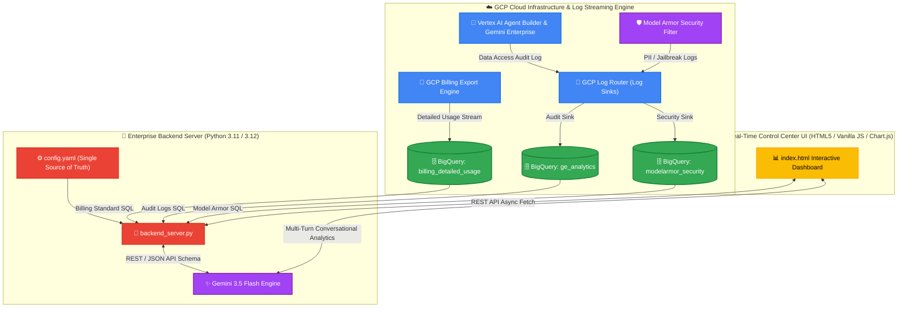

# 🛡️ Enterprise AI Governance & Agent Platform Dashboard
> **엔터프라이즈 통합 AI 거버넌스 및 Agent 플랫폼 관제 시스템 설치 & 운용 마스터 가이드**

---

## 📐 1. 전체 아키텍처 및 시스템 원리 (System Architecture)

본 플랫폼은 Google Cloud Platform(GCP) 상에서 발생하는 모든 AI 프롬프트 사용량, 과금 비용, 사용자 활동 감사 로그, Model Armor 보안 차단 이벤트를 BigQuery로 실시간 수집하여 통합 관제 대시보드로 시각화합니다.



---

## 🛠️ 2. 필수 사전 환경 구축 (Prerequisites & OS-Specific Installation)

실행 도중 `command not found` 오류가 절대 발생하지 않도록, 보유하신 OS에 맞게 명령어를 복사하여 터미널(Terminal / PowerShell)에 입력하십시오.

### 2.1 Python 3.10+ 설치 가이드

#### 🍎 macOS (Homebrew 사용)
```bash
# Homebrew 설치 (미설치 시)
/bin/bash -c "$(curl -fsSL https://raw.githubusercontent.com/Homebrew/install/HEAD/install.sh)"

# Python 3.11 설치
brew install python@3.11
python3 --version
```

#### 🐧 Linux (Ubuntu / Debian)
```bash
sudo apt update && sudo apt install -y python3 python3-pip python3-venv git curl
python3 --version
```

#### 🐧 Linux (RHEL / CentOS / Rocky Linux)
```bash
sudo dnf install -y python311 python3-pip git curl
python3 --version
```

#### 🪟 Windows (PowerShell 관리자 권한)
```powershell
# Chocolatey 사용 시
choco install python --version=3.11.8 -y

# 또는 winget 사용 시
winget install Python.Python.3.11
```

---

### 2.2 Google Cloud SDK (`gcloud` CLI) 및 Git 설치 가이드

#### 🍎 macOS
```bash
brew install --cask google-cloud-sdk git
```

#### 🐧 Linux (Ubuntu/Debian)
```bash
sudo apt-get install -y apt-transport-https ca-certificates gnupg curl git
echo "deb [signed-by=/usr/share/keyrings/cloud.google.gpg] https://packages.cloud.google.com/apt cloud-sdk main" | sudo tee -a /etc/apt/sources.list.d/google-cloud-sdk.list
curl https://packages.cloud.google.com/apt/doc/apt-key.gpg | sudo gpg --dearmor -o /usr/share/keyrings/cloud.google.gpg
sudo apt-get update && sudo apt-get install -y google-cloud-cli
```

#### 🪟 Windows (PowerShell)
```powershell
winget install Google.CloudSDK
```

#### 🔑 Google Cloud 인증 가이드
설치 후 아래 2개 명령어를 순서대로 실행하여 인증 로그인을 수행합니다:
```bash
# 1. 일반 사용자 인증
gcloud auth login

# 2. Application Default Credentials (ADC) 인증 (Cloud Platform Scope 포함 필수)
gcloud auth application-default login --scopes="https://www.googleapis.com/auth/cloud-platform"
```

---

## ☁️ 3. GCP Billing Export (상세 과금 데이터) 설정 방법 초상세 가이드

본 대시보드의 LLM 모델별 과금 추이 및 SKU별 비용 리포트를 동적으로 시각화하려면 GCP 콘솔에서 **Billing Detailed Export (상세 비용 데이터 내보내기)**를 사전 설정해야 합니다.

### 3.1 GCP 콘솔에서 Billing Detailed Export 활성화 스텝-바이-스텝
1. **GCP 콘솔 접속**: [Google Cloud Console](https://console.cloud.google.com/)에 결제 관리자(Billing Administrator) 계정으로 로그인합니다.
2. **Billing (결제) 메뉴 이동**: 좌측 상단 탐색 메뉴(≡) -> **Billing (결제)**를 클릭합니다.
3. **Billing Export 메뉴 이동**: 좌측 사이드바 메뉴에서 **Billing export (결제 데이터 내보내기)**를 클릭합니다.
4. **Detailed cost export 설정**:
   - **Detailed cost export (상세 비용 데이터 내보내기)** 탭을 선택하고 **Edit settings (설정 수정)** 버튼을 클릭합니다.
   - **Projects (프로젝트)**: 과금 데이터를 저장할 GCP 프로젝트 ID(예: `your-gcp-project-id`)를 선택합니다.
   - **Dataset ID (데이터셋 ID)**: BigQuery 데이터셋 명칭(예: `billing_detailed_usage`)을 입력하거나 신규 생성합니다.
   - **Save (저장)** 버튼을 클릭합니다.
5. **결과 확인**:
   - 설정 완료 후 몇 분 내에 BigQuery 내 해당 데이터셋에 `gcp_billing_export_resource_v1_<BILLING_ACCOUNT_ID>` 이름의 실시간 과금 스트리밍 테이블이 자동으로 생성됩니다.
   - 테이블명의 끝자리 18자리 문자열(예: `gcp_billing_export_resource_v1_01E9C5_E0B654_4D2CB0`)을 복사하여 `config.yaml` 파일의 `table_id` 항목에 입력합니다.

---

## ⚙️ 4. 환경설정 파일 (`config.yaml`) 운용 안내

본 프로그램은 **`config.yaml` 파일 단 하나만 수정하면 전체 시스템 백엔드 및 프론트엔드가 100% 자동 적용**되도록 완벽히 설계되어 있습니다. 본 소스 코드는 수정을 전혀 하실 필요가 없습니다!

`config.yaml` 파일 내용:
```yaml
# ==============================================================================
# Enterprise AI Governance & Agent Platform Dashboard Configuration
# ==============================================================================

server:
  port: 8088              # 서비스 포트 (기본값: 8088)
  host: "0.0.0.0"
  cache_ttl_seconds: 300  # API 응답 쿼리 캐시 유지 시간 (초)

gcp:
  # 고객사의 실제 GCP 프로젝트 ID로 변경하십시오.
  project_id: "your-gcp-project-id"
  
  # BigQuery 감사 로그 데이터셋 ID
  audit_dataset_id: "ge_analytics"
  
  # BigQuery GCP Billing Detailed Export 데이터셋 및 스트리밍 테이블 ID
  billing:
    dataset_id: "billing_detailed_usage"
    table_id: "gcp_billing_export_resource_v1_XXXXXX_XXXXXX_XXXXXX"
    account_id: "XXXXXX-XXXXXX-XXXXXX"

dashboard:
  title: "Enterprise AI Governance"
  subtitle: "AI Governance & Agent Platform Control Center"
```

---

## ☁️ 5. GCP Log Router (감사 로그 싱크) 생성 가이드

GCP 관리자는 대시보드 감사 로그 및 보안 로그 수집을 위해 아래 명령어를 실행해야 합니다.

```bash
# 프로젝트 ID 설정
export PROJECT_ID="your-gcp-project-id"

# 1. 감사 로그 데이터셋 및 보안 데이터셋 사전 생성
gcloud alpha bq datasets create ge_analytics --project=$PROJECT_ID --location=us-central1
gcloud alpha bq datasets create modelarmor_security --project=$PROJECT_ID --location=us-central1

# 2. GCP 통합 감사 및 보안 로그 싱크 생성 (Vertex AI, Agent Builder, Model Armor, Audit Log 전체)
gcloud logging sinks create ge_discoveryengine_logs_sink \
  bigquery.googleapis.com/projects/$PROJECT_ID/datasets/ge_analytics \
  --log-filter='protoPayload.serviceName="discoveryengine.googleapis.com" OR protoPayload.serviceName="generativelanguage.googleapis.com" OR protoPayload.serviceName="aiplatform.googleapis.com" OR protoPayload.serviceName="modelarmor.googleapis.com" OR resource.type="modelarmor.googleapis.com/SanitizeOperation" OR logName:"modelarmor" OR logName:"discoveryengine" OR logName:"cloudaudit.googleapis.com"' \
  --project=$PROJECT_ID

# 3. Model Armor 보안 차단 로그 싱크 생성
gcloud logging sinks create lges-modelarmor-sink \
  bigquery.googleapis.com/projects/$PROJECT_ID/datasets/modelarmor_security \
  --log-filter='jsonPayload.event_type="MODEL_ARMOR_BLOCK"' \
  --project=$PROJECT_ID
```

---

## 💻 6. 로컬(Local) 환경 가동 및 검증 방법

```bash
# 1. 가상환경 생성 및 활성화
python3 -m venv venv
source venv/bin/activate  # Windows: venv\Scripts\activate

# 2. 필수 라이브러리 설치
pip install google-cloud-bigquery google-auth google-api-python-client PyYAML

# 3. 대시보드 백엔드 가동
python3 backend_server.py
```
* 서버 가동 후 웹 브라우저를 열고 `http://localhost:8088`에 접속합니다.

---

## 🚀 7. GCP Cloud Run 실서버 자동 배포 가이드

```bash
# 1. GCP 프로젝트 지정
gcloud config set project your-gcp-project-id

# 2. Cloud Run 원클릭 배포
gcloud run deploy enterprise-ai-governance-dashboard \
  --source . \
  --region us-central1 \
  --allow-unauthenticated \
  --port 8080
```
* 배포가 완료되면 터미널에 생성된 `https://...run.app` 실서버 Live URL로 즉시 접속 가능합니다.

---

## ❓ 8. 트러블슈팅 및 자주 묻는 질문 (FAQ)

### Q1. 당일 Gemini 3.5 Flash 호출 통계 및 과금 비용이 대시보드 그래프에 바로 안 보입니다.
> **원인**: GCP Billing Detailed Export (BigQuery 과금 연동) 파이프라인 특성상 **2시간~4시간(최대 12시간)의 배치 정산 지연(Latency)**이 발생합니다.<br>
> **해결**: 구글 과금 파이프라인 정산 후 BigQuery에 집계되면 그래프에 동적 반영됩니다.

### Q2. `401 ACCESS_TOKEN_TYPE_UNSUPPORTED` 에러가 발생합니다.
> **해결**: 아래 명령어로 ADC 자격 증명을 갱신합니다.
> ```bash
> gcloud auth application-default login --scopes="https://www.googleapis.com/auth/cloud-platform"
> ```

### Q3. `Address already in use` 오류가 발생합니다.
> **해결**: 아래 명령어로 8088 포트 점유 프로세스를 종료합니다.
> ```bash
> lsof -ti:8088 | xargs kill -9
> ```

---
* **문서 버전**: v1.0.0 Enterprise Release
* **라이선스**: Enterprise Platform License
