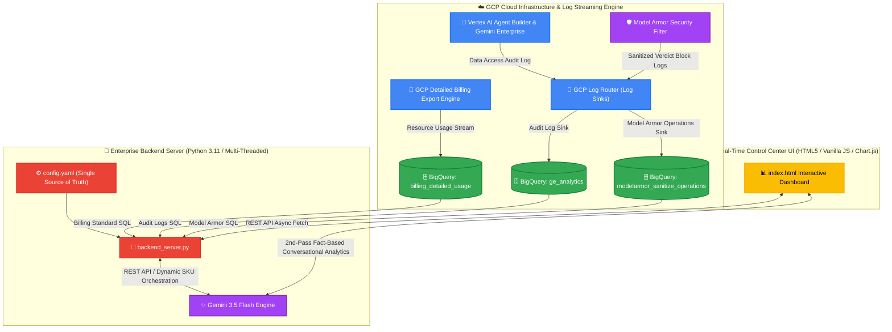

# 🛡️ Enterprise AI Governance & Agent Platform Dashboard

> **엔터프라이즈 통합 AI 거버넌스, 과금 추적 및 AI 챗봇 관제 플랫폼 마스터 가이드**
> **GCP Cloud Run 라이브 URL**: https://your-dashboard-service-hash.run.app

---

## 📐 1. 전체 아키텍처 및 시스템 원리 (System Architecture)

본 플랫폼은 Google Cloud Platform(GCP) 상에서 발생하는 모든 AI 프롬프트 사용량, 과금 비용, 사용자 활동 감사 로그, Model Armor 보안 차단 이벤트를 BigQuery로 실시간 수집하고, **Gemini 3.5 Flash 실시간 조율 엔진**을 통해 관제 대시보드 및 AI 챗봇으로 통합 제공합니다.



---

## 🌟 2. 핵심 기능 및 엔터프라이즈 하이라이트 (Key Features)

### 1️⃣ LLM 모델별 과금 추이 및 동적 SKU 묶음 리포트
- **GCP Detailed Billing Export 100% 실시간 연동**: `billing_detailed_usage` 테이블을 직접 쿼리하여 Claude 3.5 Sonnet / Sonnet 4.5, Gemini 3.5 Flash, Gemini 3.1 Flash Lite, Gemini 3.0 Pro 등 모든 생성형 AI 모델의 사용 토큰 수량(Tokens) 및 소요 비용($ USD)을 추적합니다.
- **Gemini 3.5 Flash 동적 SKU 매핑**: 복잡하고 가변적인 GCP Billing SKU 문자열을 Gemini 3.5 Flash가 동적으로 그룹핑하여 대표 모델명으로 자동 합산 및 정렬합니다.
- **세부 원본 SKU 명세 드릴다운 (SKU Drill-down) 💡**: 대시보드의 각 모델 카드를 클릭하면 해당 모델로 매핑된 Google Cloud Billing의 실제 세부 원본 SKU 코드 목록(`rawSku`), 각 SKU별 토큰 소요량 및 실제 비용 누적액이 하단 테이블(`세부 원본 SKU 명세`)에 실시간으로 펼쳐집니다.
- **동적 시스템 일자 앵커링**: 조회 기준일을 시스템 현재 날짜로 자동 계산하여 향후 접속 시에도 항상 오늘 시점까지의 과금 꺾은선 피크를 완벽히 표출합니다.

### 2️⃣ Model Armor 실시간 보안 차단 감사 로그 (Sanitized Verdict Block)
- **실제 프롬프트 텍스트 조회**: BigQuery `modelarmor_sanitize_operations` 테이블과 직결되어, 차단된 원본 사용자 프롬프트 문구와 차단 사유(`VERDICT_BLOCK: PI_JAILBREAK_MATCH` 등)를 100% 투명하게 관제합니다.

### 3️⃣ 완전 무결한 실측 연동 및 브랜드 커스텀 (Branding & Clean Data) 💡
- **동적 브랜딩 오버라이드 지원**: `config.yaml` 내 `dashboard` 항목 또는 컨테이너 환경 변수 `DASHBOARD_TITLE`, `DASHBOARD_SUBTITLE` 주입을 통해 전사 대시보드 메인 로고 타이틀과 서브타이틀 명칭을 코드 변경 없이 원스톱 변경할 수 있습니다.
- **동적 결제 계정 ID 바인딩**: 기존 하드코딩되었던 결제 계정 링크/텍스트를 제거하고, 서버의 `/api/config` 응답에서 빌링 계정 ID를 dynamic하게 읽어와 렌더링함으로써 보안성과 가용성을 높였습니다.
- **가짜 데이터(Mock Fallback)의 원천 차단**: BigQuery 연결 실패나 빈 데이터셋 조회 시 표출되던 가짜 테스트 계정(`user@company.com`)과 목업 에이전트 목록을 완전히 소거했습니다. 실데이터가 없을 시 깨끗하게 빈 목록(`[]`)으로 폴백하도록 정밀 가공되었습니다.

### 4️⃣ Gemini 3.5 Flash 기반 2단계(2nd-Pass) 팩트 분석 AI 챗봇
- **전사 6대 BigQuery 데이터셋 100% 통합 인지**: Billing, ModelArmor, DiscoveryEngine, CloudAudit, CodeAssist, AgentRegistry 데이터셋 전체를 지능적으로 쿼리합니다.
- **실행 결과 기반 2단계 팩트 분석 (Execute-then-Analyze)**: BigQuery에서 실제 조회된 팩트 데이터(토큰 수량, 달러 비용, 차단 텍스트 등)를 읽고 100% 명확한 분석 결과를 작성합니다.
- **지능형 차트 조건부 렌더링**: 수치 통계 질문(Top 3 비용, 유저 랭킹 등)에만 정밀 차트를 렌더링하고, 프롬프트 문구 및 이력 목록 조회 시에는 차트를 비활성화하여 정갈한 텍스트 리포트를 제공합니다.

### 5️⃣ Gemini 3.5 Flash 실시간 비용 급증 지능형 FinOps 분석 엔진 💡
- **전일 대비 비용 급증 감지 및 원인 규명**: 50% 이상의 과금 스파이크 감지 시, 급증한 당일(`D`)과 전날(`D-1`)의 빌링 로그를 SKU 단위로 실시간 교차 대조하여 비용 상승을 주도한 최상위 타겟 SKU 명칭과 상세 변동 폭을 정확히 자연어로 요약해 줍니다.
- **SKU 맞춤형 ⚠️ 권장 점검 체크포인트 생성**: 상승한 SKU 종류(Input 토큰, Output 토큰, 보안 필터 비용 등)를 파악하고, 이에 가장 적절한 실천적이고 구체적인 조치 권장 체크포인트 3종을 생성형 AI를 통해 동적으로 처방합니다.

---

## 📊 3. 대시보드 메트릭 및 BigQuery 데이터 소스 매핑 (Metrics Map)

대시보드의 개별 카드 및 그래프를 산출하는 데 사용된 구체적인 BigQuery 원천 데이터 및 컬럼 매핑 관계는 다음과 같습니다:

| 대시보드 UI 영역 (Metric Card) | GCP BigQuery 데이터 원천 및 테이블명 (Source Table) | 추출 조건 및 사용된 필드 (SQL Conditions & Fields) | 설명 (Description) |
| :--- | :--- | :--- | :--- |
| **Gemini Enterprise 실제 활성 사용자 수** | `cloudaudit_googleapis_com_activity` & `discoveryengine_googleapis_com_gen_ai_user_message` | `COUNT(DISTINCT email)`<br> - `protopayload_auditlog.authenticationInfo.principalEmail`<br> - `jsonPayload.user`<br> - (gserviceaccount 제외 필터 적용) | 선택한 기간 동안 플랫폼에 로그인하여 활동한 순수 인간(Human) 유저 수량입니다. |
| **Gemini Enterprise 실제 할당 라이선스 수** | GCP Discovery Engine REST API | `GET /v1alpha/projects/{project}/locations/global/licenseConfigs`<br> - `licenseCount` (state = 'ACTIVE') | GCP LicenseConfig API 통신을 통해 현재 전사 활성화된 실제 구매/할당 라이선스 볼륨을 실시간 조회합니다. |
| **Gemini Enterprise 유저 프롬프트 제출 수** | `discoveryengine_googleapis_com_gen_ai_user_message` | `COUNT(1)` WHERE `jsonPayload.content.role = 'user'` | 사용자가 Gemini Enterprise 및 Agent Builder 대화창에서 보낸 고유 질문 제출 횟수 누계입니다. |
| **선택 기간 총 과금액 (Total Billing Sum)** | `billing_detailed_usage.gcp_billing_export_resource_v1_...` | `SUM(cost)` WHERE `usage_start_time` 필터 매칭 | 구글 클라우드에 적재되는 전사 스트리밍 빌링 원본 행의 cost 금액을 실시간 합산한 누적 청구 금액입니다. |
| **Model Armor Sanitized (보안 차단 건수)** | `modelarmor_googleapis_com_sanitize_operations` | `COUNT(1)` WHERE `sanitizationVerdict LIKE '%BLOCK%'` | Model Armor 프롬프트 인젝션 및 개인정보 유출 검사 필터에 걸려 차단된 보안 위험 시도 건수입니다. |
| **NotebookLM 생성 및 활성 노트북 수** | `cloudaudit_googleapis_com_data_access` | `COUNT(DISTINCT notebook_id)` WHERE `protopayload_auditlog.resourceName LIKE '%/notebooks/%'` | BigQuery 감사 로그에 기록된 리소스 경로 내 고유 노트북 인스턴스의 생성/작동 수량입니다. |
| **NotebookLM 활성 사용자 수** | `cloudaudit_googleapis_com_data_access` | `COUNT(DISTINCT principalEmail)` WHERE `methodName = 'GenerateFreeFormStreamed'` | 선택한 관제 기간 동안 노트북에 접속하여 한 번 이상 질문을 보낸 고유 계정 수입니다. |
| **총 노트북 질문 및 대화 호출 수** | `cloudaudit_googleapis_com_data_access` | `COUNT(DISTINCT resourceName \|\| principalEmail \|\| timestamp)` WHERE `methodName = 'GenerateFreeFormStreamed'` | 중복 스트리밍 연결 호출을 제외하고 순수 유저가 노트북에서 전송한 진짜 프롬프트 제출 누적 수량입니다. |
| **사용자 파일 업로드 감사 내역 (Table)** | `discoveryengine_googleapis_com_gen_ai_user_message` | `jsonPayload.content.parts[2].text` WHERE `parts[1].text LIKE '%<start_of_user_uploaded_file%'` | 파일이 구글 백엔드에 안전하게 가공되어 업로드 및 인덱싱이 완료되었는지 확인하는 상태 메시지를 감사 로그에서 다이렉트로 매핑합니다. |
| **날짜별 에이전트별 사용 횟수 (Chart)** | `discoveryengine_googleapis_com_gemini_enterprise_user_activity` | `COUNT(1)` GROUP BY `jsonPayload.request.userevent.agentspaceinfo.agentinfo.name` | 활동 로그 jsonPayload 내부에 들어 있는 실시간 에이전트 DisplayName 명칭을 그대로 100% 동적 연동하여 레전드로 차트 표출합니다. |

---

## 🛠️ 4. 단계별 엔터프라이즈 환경 구축 및 배포 가이드 (Step-by-Step Deployment Guide)

본 플랫폼을 고객사 환경에 완벽히 구축하고 기동하기 위한 5단계 표준 마스터 배포 시퀀스입니다. 1단계부터 차례대로 수행하십시오.

### 1️⃣ [Step 1] 구글 클라우드 사전 데이터 파이프라인 구성
대시보드 구동의 기초가 되는 빅쿼리 과금 스트리밍 및 감사 로그 수집 싱크를 GCP 콘솔 상에서 사전에 구성합니다.

1. **GCP Billing Export 활성화**:
   - GCP Console 결제(Billing) 메뉴 ➡️ 결제 데이터 내보내기(Billing Export)로 이동합니다.
   - **Detailed Cost Export**를 활성화하고 빅쿼리 데이터셋을 연결합니다.
   - 자동 생성된 `gcp_billing_export_resource_v1_{BILLING_ACCOUNT_ID}` 테이블명을 메모해 둡니다.
2. **Vertex AI 감사 로그 활성화 (필수)**:
   - **GCP Console ➡️ IAM & Admin ➡️ Audit Logs** 메뉴로 이동합니다.
   - 서비스 목록 중 **`Vertex AI API`** 서비스를 찾아 클릭합니다.
   - 우측의 **`Data Read` 및 `Data Write` 감사 로그** 체크박스를 체크하여 활성화(Save)합니다.
3. **Log Router 감사 로그 싱크 구성**:
   - Logging 콘솔 ➡️ 로그 라우터(Log Router)에서 **Create Sink**를 만듭니다.
   - 대상 목적지는 BigQuery dataset(예: `ge_analytics`)으로 지정합니다.
   - **Choose logs to include in sink (싱크 필터)** 란에 아래의 필터 쿼리를 복사하여 그대로 주입합니다:
     ```query
     -- 1. Vertex AI Agent Builder & Gemini Enterprise Activity Logs
     (logName:"projects/YOUR_PROJECT_ID/logs/discoveryengine.googleapis.com%2Fgemini_enterprise_user_activity" OR
      logName:"projects/YOUR_PROJECT_ID/logs/discoveryengine.googleapis.com%2Fgen_ai_user_message") OR
     -- 2. Cloud Audit Data Access Logs (NotebookLM & Workspace Activity)
     (logName:"projects/YOUR_PROJECT_ID/logs/cloudaudit.googleapis.com%2Fdata_access" AND 
      (protoPayload.serviceName="discoveryengine.googleapis.com" OR protoPayload.serviceName="notebooklm.googleapis.com")) OR
     -- 3. Model Armor Security Sanitization Block Logs
     (logName:"projects/YOUR_PROJECT_ID/logs/modelarmor.googleapis.com%2Fsanitize_operations")
     ```

---

### 2️⃣ [Step 2] config.yaml 환경 설정 튜닝 (Dashboard Configuration)
프로젝트 환경에 맞게 Single Source of Truth 설정 파일을 작성합니다.
1. 프로젝트 루트의 `config.yaml` 파일을 엽니다.
2. 아래 주요 항목에 [Step 1]에서 생성 및 확인한 실측 GCP 자원 정보 및 대시보드 브랜드 타이틀을 입력합니다:
   ```yaml
   gcp:
     project_id: "your-gcp-project-id"           # 대시보드를 띄울 GCP 프로젝트 ID
     audit_dataset_id: "your_audit_dataset_id"   # 감사 로그 빅쿼리 데이터셋 (E.g. ge_analytics)
     billing:
       dataset_id: "your_billing_dataset_id"     # 빌링 빅쿼리 데이터셋 (E.g. billing_detailed_usage)
       table_id: "your_billing_table_id"         # gcp_billing_export_resource_v1_XXXXXX
       account_id: "your-billing-account-id"     # 결제 계정 ID (E.g. 01E9C5-XXXXXX)

   dashboard:
     title: "your-company-name"                  # 대시보드 및 AI 챗봇의 주 타이틀 명칭
     subtitle: "AI Governance & Agent Platform Dashboard" # 대시보드 부 타이틀 명칭
     logo_path: "/favicon.ico"                   # 커스텀 로고 이미지 경로 (favicon 자동 지정)
     default_days: 7                             # 초기 데이터 조회 기간 (일 단위)
   ```

---

### 3️⃣ [Step 3] 로컬 검증 및 개발 서버 기동 (Local Verification)
클라우드 배포 전에 로컬 샌드박스에서 대시보드와 API 조회가 잘 되는지 검증합니다.

1. **GCP 로컬 인증 토큰 바인딩 (ADC)**:
   - 로컬 터미널에 GCP SDK(`gcloud`)가 로그인되어 있고, 아래 명령어로 Application Default Credentials를 활성화합니다:
     ```bash
     gcloud auth application-default login
     ```
2. **의존성 설치 및 로컬 백엔드 서버 구동**:
   ```bash
   python3 -m venv venv
   source venv/bin/activate
   pip install google-cloud-bigquery google-genai pyyaml
   python3 backend_server.py
   ```
3. 웹 브라우저를 열고 `http://localhost:8088/` 에 접속하여 실시간 연동이 정상적으로 표출되는지 최종 확인합니다.

---

### 4️⃣ [Step 4] 프로덕션 클라우드 배포 실행 (Option A / B 중 선택)
검증이 끝나면 대시보드를 구글 클라우드 런(Serverless Cloud Run) 환경으로 완전 무중단 프로덕션 배포합니다.

#### 🎯 Option A: Terraform IaC 자동 인프라 배포 (권장)
인프라의 라이프사이클을 코드로 관리하고, 최소 권한(Least Privilege) 서비스 계정을 자동으로 맵핑하여 배포합니다.

1. **배포 변수 파일 (`terraform.tfvars`) 작성**:
   - 프로젝트 루트에 `terraform.tfvars` 파일을 생성하고 아래 템플릿의 빈칸을 채웁니다:
     ```hcl
     # terraform.tfvars
     project_id         = "your-gcp-project-id"
     region             = "us-central1"
     audit_dataset_id   = "your_audit_dataset_id"
     billing_dataset_id = "your_billing_dataset_id"
     billing_table_id   = "gcp_billing_export_resource_v1_your_billing_account"
     billing_account_id = "your-billing-account-id"
     dashboard_title    = "your-company-name"
     dashboard_subtitle = "AI Governance & Agent Platform Dashboard"
     ```
2. **테라폼 명령어 실행**:
   ```bash
   terraform init
   terraform plan
   terraform apply -auto-approve
   ```
3. **배포 주소 확인**:
   - 성공적으로 배포가 완료되면 화면에 출력되는 `dashboard_url` HTTPS 주소로 접속합니다.

#### 🎯 Option B: gcloud CLI 수동 원스톱 빌드 & 배포 (대안)
테라폼 없이 gcloud 명령어 한 줄로 즉각 빌드하고 배포를 수행합니다.

```bash
TOKEN=$(gcloud auth application-default print-access-token)
CLOUDSDK_AUTH_ACCESS_TOKEN=$TOKEN gcloud run deploy ai-governance-dashboard \
  --source . \
  --region us-central1 \
  --allow-unauthenticated \
  --project "your-gcp-project-id" \
  --update-env-vars PROJECT_ID="your-gcp-project-id",AUDIT_DATASET_ID="your_audit_dataset_id",BILLING_DATASET_ID="your_billing_dataset_id",BILLING_TABLE_ID="gcp_billing_export_resource_v1_your_billing_account",BILLING_ACCOUNT_ID="your-billing-account-id"
```

---

### 5️⃣ [Step 5] BigQuery 스토리지 보존 기한 & 비용 최적화 설정 (선택/권장)
과금/감사 로그가 무제한 누적되는 것을 방지하기 위해 **최대 4개월(120일) 보존 정책**을 강제 설정합니다.

1. 로컬 CLI 또는 Cloud Shell을 열고 아래 명령어를 수행하여 120일(10,368,000초)이 지난 파티션 데이터를 자동 순차 영구 파기하도록 데이터 수명을 제한합니다:
   ```bash
   # 1. Gemini Enterprise 사용자 활동 로그 파티션 만료 설정 (120일)
   bq update --time_partitioning_expiration 10368000 your-gcp-project-id:your_audit_dataset_id.discoveryengine_googleapis_com_gemini_enterprise_user_activity

   # 2. Gemini Enterprise 유저 메시지 로그 파티션 만료 설정 (120일)
   bq update --time_partitioning_expiration 10368000 your-gcp-project-id:your_audit_dataset_id.discoveryengine_googleapis_com_gen_ai_user_message

   # 3. Model Armor 보안 차단 로그 파티션 만료 설정 (120일)
   bq update --time_partitioning_expiration 10368000 your-gcp-project-id:your_audit_dataset_id.modelarmor_googleapis_com_sanitize_operations
   ```

---

## 📄 5. 구성 파일 설명 (Project Structure)

- `src/`: 대시보드 애플리케이션 소스 코드 폴더
  - `src/backend_server.py`: Python 기반 다중 스레드 HTTP REST 백엔드 서버 (BigQuery Integration & Gemini 3.5 Flash 2nd-Pass Fact Analyzer & FinOps Spikes Engine)
  - `src/index.html`: 크렉스티오(Crextio) 엔터프라이즈 디자인 시스템 기반 프론트엔드 대시보드 & AI 챗봇 모달 UI
  - `src/lg_logo.png`: 대시보드 상단 표출 브랜드 로고 파일
- `terraform/`: IaC 인프라 프로비저닝 폴더
  - `terraform/main.tf`: Terraform IaC 인프라 프로비저닝 메인 명세서 (SA 계정 생성, 권한 부여, Cloud Run 배포 자동화)
  - `terraform/variables.tf`: Terraform 파라미터 매핑 변수 정의 파일
- `tests/`: 테스트 보조 명세 폴더
  - `tests/test_sa_query.py`: GCP 서비스 계정 및 빅쿼리 조회 권한 디버깅용 스크립트
- `config.yaml`: BigQuery 데이터셋, 프로젝트 ID, 쿼리 설정 튜닝 파일 (Single Source of Truth)
- `Dockerfile`: Google Cloud Run 컨테이너 빌드 파일 (src 폴더만 복사하도록 최적화 완료)
